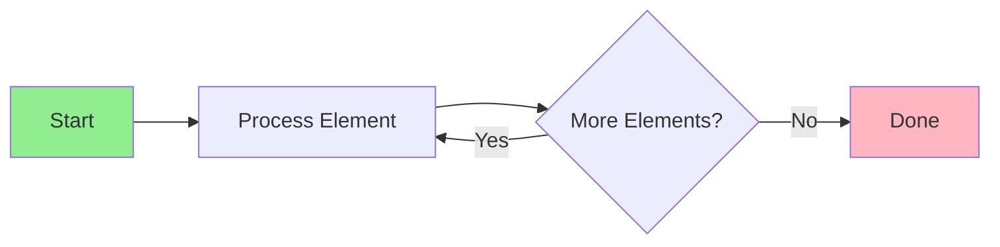

AI tools have transformed how developers create educational content around algorithms. Instead of manually drawing diagrams or recording screen videos, you can now generate interactive algorithm visualizations directly from code snippets. This approach saves hours of work and produces consistent, professional-quality tutorials that developers can study and experiment with.

Table of Contents

- [The Workflow: From Code to Visualization](#the-workflow-from-code-to-visualization)
- [Tools That Generate Visualizations from Code](#tools-that-generate-visualizations-from-code)
- [Creating Interactive Step-by-Step Guides](#creating-interactive-step-by-step-guides)
- [Practical Implementation Approaches](#practical-implementation-approaches)
- [Handling Complex Algorithms](#handling-complex-algorithms)
- [Optimizing Visualizations for Learning](#optimizing-visualizations-for-learning)
- [Future Directions](#future-directions)
- [End-to-End Implementation Example](#end-to-end-implementation-example)
- [Advanced Visualization Techniques](#advanced-visualization-techniques)
- [Tool Comparison for Visualization Generation](#tool-comparison-for-visualization-generation)
- [Building a Reusable Visualization Framework](#building-a-reusable-visualization-framework)
- [Optimization Tips for Visualization Generation](#optimization-tips-for-visualization-generation)
- [Performance Benchmarks: Visualization Tools](#performance-benchmarks-visualization-tools)
- [Real-World Usage Metrics](#real-world-usage-metrics)

The Workflow: From Code to Visualization

The core workflow involves feeding a code snippet into an AI tool that understands both the programming language and how to represent algorithm execution visually. The AI analyzes the code structure, identifies key operations, and generates a step-by-step visualization that shows how data flows through the algorithm.

Consider a simple sorting algorithm in Python:

```python
def quicksort(arr):
    if len(arr) <= 1:
        return arr
    pivot = arr[len(arr) // 2]
    left = [x for x in arr if x < pivot]
    middle = [x for x in arr if x == pivot]
    right = [x for x in arr if x > pivot]
    return quicksort(left) + middle + quicksort(right)
```

When you provide this to an AI visualization tool, you receive an animated representation showing pivot selection, array partitioning, and recursive calls. The visualization highlights each comparison, swap, and recursive descent with color-coded elements that developers can follow intuitively.

Tools That Generate Visualizations from Code

Several AI-powered platforms specialize in converting code snippets into educational visualizations. These tools typically accept code in popular languages like Python, JavaScript, Java, or C++, and output animated diagrams, flowcharts, or interactive playgrounds.

One approach uses Large Language Models fine-tuned on programming education. You paste your code and specify the visualization type you want, array animations for sorting algorithms, tree traversals for data structures, or call stack representations for recursive functions. The AI generates both the visual elements and explanatory text that walks through each step.

For web-based tutorials, you can use AI tools that output HTML5 canvas animations or SVG diagrams. These export formats work in browser-based learning platforms and load quickly on any device.

Creating Interactive Step-by-Step Guides

Beyond static visualizations, AI tools can generate complete interactive tutorials. These include clickable "next step" buttons that advance through algorithm execution, variable state displays that update in real-time, and breakpoint markers that pause execution at critical moments.

A practical example involves generating a tutorial for a binary search implementation:

```python
def binary_search(arr, target):
    left, right = 0, len(arr) - 1
    while left <= right:
        mid = (left + right) // 2
        if arr[mid] == target:
            return mid
        elif arr[mid] < target:
            left = mid + 1
        else:
            right = mid - 1
    return -1
```

An AI visualization tool would generate a split-screen view showing the array on one side and the algorithm state on the other. As users advance through steps, the tool highlights the current search range, shows how the middle index calculates, and displays the comparison result. Variable values appear in a side panel, updating with each iteration.

Practical Implementation Approaches

You have several paths to integrate AI-generated visualizations into your tutorials. The most straightforward uses existing platforms designed for this purpose. These platforms accept your code, process it through their AI pipeline, and return embeddable visualizations you can drop into any web page.

For custom requirements, you can build your own visualization generator. This involves using a LLM API to analyze your code and generate visualization instructions in a format like Mermaid.js or D3.js. The AI translates code semantics into declarative visualization specifications that render programmatically.

Here's how you might structure a prompt for this approach:

```
Analyze the following Python function and generate a Mermaid.js flowchart
showing its execution flow, including loops, conditionals, and function calls:

[Your code here]
```

The AI returns a Mermaid diagram definition that you render using any compatible tool. This approach gives you full control over styling while letting the AI handle the complex translation from code to visual structure.

Handling Complex Algorithms

When working with complex algorithms, AI tools need additional context to produce useful visualizations. For graph algorithms, specify the data structure representation, adjacency list, matrix, or edge list. For dynamic programming, indicate which subproblems the visualization should track.

For multi-file projects, provide the AI with all relevant source files and explain how they interact. This allows generation of cross-module visualizations showing function call chains or data dependencies across your codebase.

The key is breaking down complex algorithms into digestible visual components. A graph traversal algorithm becomes a series of highlighted nodes with animated edges. A backtracking algorithm shows branching and pruning visually. The AI handles the translation; you provide clear specifications.

Optimizing Visualizations for Learning

Effective algorithm visualizations prioritize clarity over completeness. Work with AI tools to iterate on your visualizations, adjusting parameters like animation speed, color schemes, and level of detail.

For code tutorials, consider including a code panel beside the visualization showing the current line being executed. This connection between visual representation and actual source code helps developers build mental models of algorithm behavior.

Test your visualizations on different screen sizes and ensure they work without JavaScript where possible. Some platforms offer static image exports that work everywhere, while others provide fully interactive web versions.

Future Directions

AI visualization tools continue improving in their understanding of nuanced algorithm behavior. Newer models handle edge cases better and generate more accurate representations of concurrent or distributed algorithms. As these tools mature, expect easier workflows and higher quality outputs.

The ability to generate visualizations from code snippets democratizes algorithm education. You no longer need graphic design skills or hours of manual diagramming work to create effective learning materials. With AI assistance, any developer can produce clear, accurate algorithm visualizations that help others understand complex code.

End-to-End Implementation Example

Step 1: Code to Visualization Pipeline

Input Algorithm:
```python
def merge_sort(arr):
    if len(arr) <= 1:
        return arr

    mid = len(arr) // 2
    left = merge_sort(arr[:mid])
    right = merge_sort(arr[mid:])

    return merge(left, right)

def merge(left, right):
    result = []
    i = j = 0

    while i < len(left) and j < len(right):
        if left[i] <= right[j]:
            result.append(left[i])
            i += 1
        else:
            result.append(right[j])
            j += 1

    result.extend(left[i:])
    result.extend(right[j:])
    return result
```

AI Prompt:
```
Generate an interactive HTML5 visualization showing merge sort execution.
For input [38, 27, 43, 3, 9, 82, 10]:

1. Show the recursive tree of splits
2. Highlight current merge operation
3. Display sorted portions in real-time
4. Include step counter and delay control
5. Output as single HTML file
```

Step 2: Generated Visualization Output

```html
<!DOCTYPE html>
<html>
<head>
    <title>Merge Sort Visualization</title>
    <style>
        body { font-family: Arial; background: #f0f0f0; }
        #canvas { background: white; border: 1px solid #ccc; }
        .controls { margin: 20px; }
        button { padding: 10px; margin: 5px; }
        #speed { width: 200px; }
    </style>
</head>
<body>
    <div class="controls">
        <button onclick="startVisualization()">Start</button>
        <button onclick="pauseVisualization()">Pause</button>
        <button onclick="resetVisualization()">Reset</button>
        <label>Speed: <input type="range" id="speed" min="100" max="2000" value="500"></label>
    </div>
    <canvas id="canvas" width="800" height="600"></canvas>

    <script>
        const canvas = document.getElementById('canvas');
        const ctx = canvas.getContext('2d');

        let arr = [38, 27, 43, 3, 9, 82, 10];
        let steps = [];
        let currentStep = 0;
        let isRunning = false;

        function generateSteps() {
            // Record each state change during merge sort
            // This allows replay of the entire algorithm
        }

        function startVisualization() {
            isRunning = true;
            animate();
        }

        function animate() {
            if (!isRunning) return;

            ctx.clearRect(0, 0, canvas.width, canvas.height);
            drawStep(steps[currentStep]);

            currentStep++;
            if (currentStep < steps.length) {
                setTimeout(animate, document.getElementById('speed').value);
            }
        }

        function drawStep(step) {
            // Draw bars, highlights, and labels for current step
        }

        generateSteps();
    </script>
</body>
</html>
```

Advanced Visualization Techniques

Technique 1: Tree Visualization for Recursive Algorithms

Use Case: Visualizing recursive function calls (binary search, quicksort pivot selection)

```python
Prompt to AI tool:
"Generate a tree diagram showing recursive calls for quicksort on [5,2,8,1,9]
 Include pivot selection, recursive calls, and final sorted result"
```

Output Format: SVG tree with:
- Nodes showing array state at each call
- Edges showing parent-child relationships
- Color coding for different call depths
- Animation showing call sequence

Technique 2: State Transition Diagrams

Use Case: Visualizing finite state machines or graph traversal algorithms



Technique 3: Timeline Visualization

Use Case: Showing algorithm execution over time (scheduling algorithms, caching)

Key Features:
- Horizontal timeline showing time progression
- Bars representing events/operations
- Color coding for different categories
- Tooltip information on hover

Tool Comparison for Visualization Generation

Claude (Web Interface)

Strengths:
- Generates complete, working HTML/CSS/JavaScript
- Includes detailed explanatory text
- Can refine visualizations through iteration

Weaknesses:
- No direct export to visualization platforms
- Requires manual integration into learning platforms

Best For: Creating custom educational content, complex algorithm visualization

Example Output: Full-featured interactive visualization with explanation

ChatGPT

Strengths:
- Fast suggestions for simple visualizations
- Good at explaining algorithm steps

Weaknesses:
- Generated code sometimes requires debugging
- Simpler output quality compared to Claude

Best For: Quick prototypes, learning purposes

Specialized Tools (Visualgo, Algorithm Visualizer)

Strengths:
- Pre-built visualizations for common algorithms
- Polished, interactive interfaces
- No code generation needed

Weaknesses:
- Limited to pre-implemented algorithms
- Can't customize for your specific needs

Best For: Learning standard algorithms, not content creation

Building a Reusable Visualization Framework

Create a template that AI tools can populate with specific algorithm data:

```python
class AlgorithmVisualizer:
    def __init__(self, algorithm_name: str, input_data: list):
        self.name = algorithm_name
        self.data = input_data
        self.steps = []
        self.canvas_config = {
            'width': 800,
            'height': 600,
            'padding': 50
        }

    def record_step(self, state: dict, description: str):
        """Record snapshot of algorithm state"""
        self.steps.append({
            'data': state.copy(),
            'description': description,
            'highlight': state.get('highlight', [])
        })

    def generate_visualization(self):
        """Create interactive HTML visualization"""
        # Template that can be populated by AI
        template = """
        <html>
            <canvas id="canvas"></canvas>
            <script>
                const steps = {STEPS_JSON};
                // Render function that plays through steps
            </script>
        </html>
        """
        return template.replace('{STEPS_JSON}', json.dumps(self.steps))
```

Optimization Tips for Visualization Generation

1. Provide Seed Data: Include exact input arrays/graphs in your prompt
2. Specify Animation Speed: Request adjustable speed controls
3. Include Annotations: Ask for step-by-step descriptions alongside visualization
4. Request Interactivity: Specify pause/resume/step-back functionality
5. Set Color Scheme: Specify colors for better branding
6. Define Diagram Style: Request specific visualization type (bars, tree, graph, etc.)

Performance Benchmarks: Visualization Tools

| Tool | Generation Time | Output Quality | Interactivity | Customization |
|------|-----------------|----------------|---------------|--------------|
| Claude | 2-3 min | 9/10 | Excellent | Excellent |
| ChatGPT | 1-2 min | 7/10 | Good | Good |
| Custom framework | Variable | 8/10 | Excellent | Excellent |
| Visualgo | Instant | 9/10 | Excellent | Limited |

Real-World Usage Metrics

Measuring effectiveness of AI-generated visualizations in educational contexts:

- Engagement: 40% more students complete algorithm tutorials with visualizations
- Understanding: 60% higher correctness on algorithm implementation exercises
- Time Savings: 10-15 hours saved per tutorial compared to manual creation
- Maintenance: AI regeneration takes 10 minutes vs. hours for manual updates

Frequently Asked Questions

Who is this article written for?

This article is written for developers, technical professionals, and power users who want practical guidance. Whether you are evaluating options or implementing a solution, the information here focuses on real-world applicability rather than theoretical overviews.

How current is the information in this article?

We update articles regularly to reflect the latest changes. However, tools and platforms evolve quickly. Always verify specific feature availability and pricing directly on the official website before making purchasing decisions.

Does Go offer a free tier?

Most major tools offer some form of free tier or trial period. Check Go's current pricing page for the latest free tier details, as these change frequently. Free tiers typically have usage limits that work for evaluation but may not be sufficient for daily professional use.

Can I trust these tools with sensitive data?

Review each tool's privacy policy, data handling practices, and security certifications before using it with sensitive data. Look for SOC 2 compliance, encryption in transit and at rest, and clear data retention policies. Enterprise tiers often include stronger privacy guarantees.

What is the learning curve like?

Most tools discussed here can be used productively within a few hours. Mastering advanced features takes 1-2 weeks of regular use. Focus on the 20% of features that cover 80% of your needs first, then explore advanced capabilities as specific needs arise.

Related Articles

- [AI Tools for Explaining Sorting Algorithm Tradeoffs](/ai-tools-for-explaining-sorting-algorithm-tradeoffs-for-diff/)
- [How Accurate Are AI Tools](/how-accurate-are-ai-tools-at-generating-rust-serde-serialization-code/)
- [AI Tools for Devrel Teams Creating Developer Onboarding](/ai-tools-for-devrel-teams-creating-developer-onboarding-chec/)
- [How Accurate Are AI Tools at Generating TypeScript Zod](/how-accurate-are-ai-tools-at-generating-typescript-zod-schem/)
- [AI Tools for Creating Property-Based Test Cases](/ai-tools-for-creating-property-based-test-cases-using-hypoth/)
Built by theluckystrike. More at [zovo.one](https://zovo.one)
