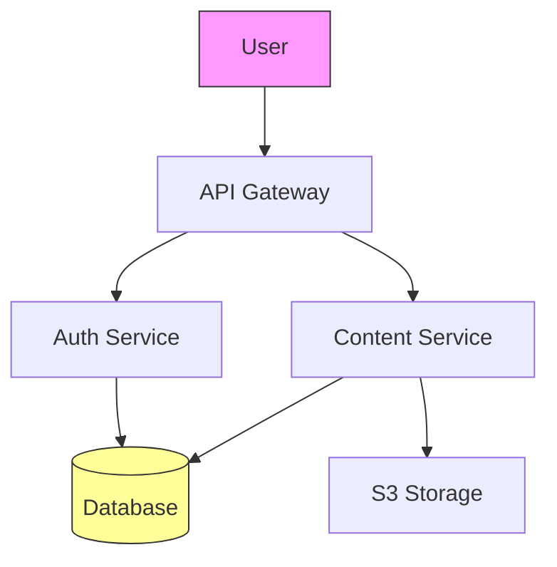
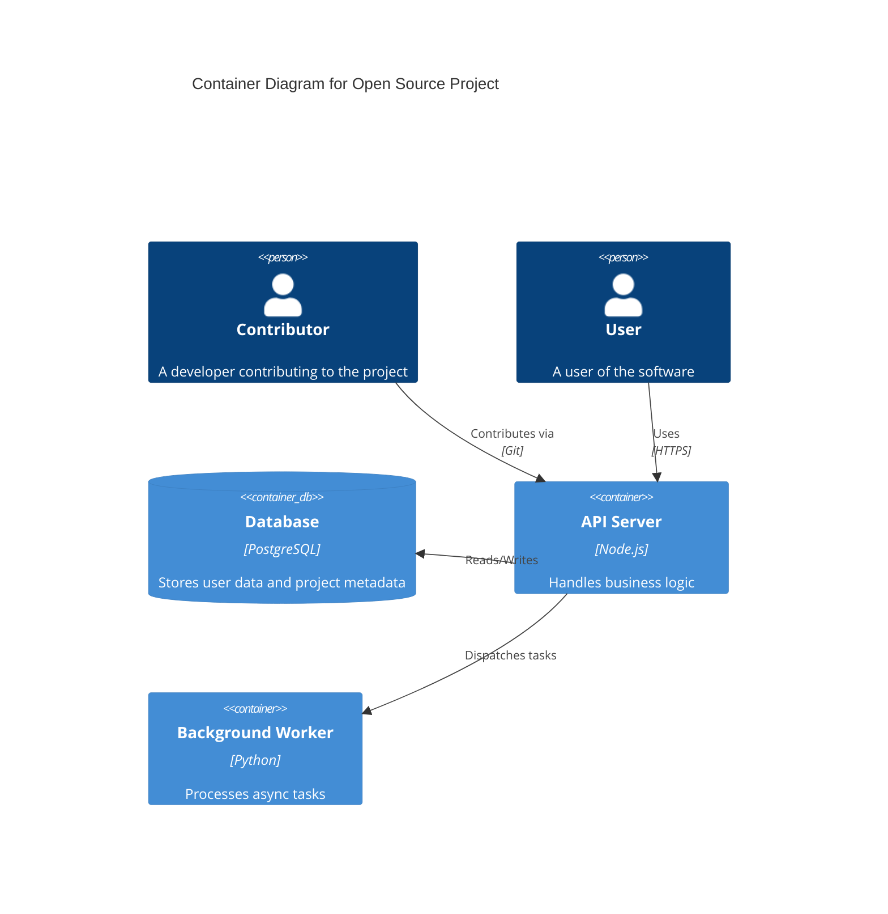


Open source projects benefit from clear architecture documentation that helps contributors understand the codebase quickly. Creating these documents manually takes significant time, especially when you need to maintain up-to-date diagrams as the project evolves. AI-powered tools now offer practical solutions for generating architecture documentation, helping maintainers communicate complex systems effectively.

## Why Architecture Documentation Matters for Open Source Projects

Clear architecture documentation serves multiple purposes in open source projects. It reduces the learning curve for new contributors, facilitates better issue discussions, and helps users understand how components interact. When your project documentation includes accurate diagrams, contributors can locate the right files faster and propose changes that align with the system's design.

However, keeping documentation synchronized with code changes presents a challenge. Many projects start with thorough documentation that becomes outdated within months. AI tools can help generate initial documentation and keep it current through iterative updates.

## Comparing AI Tools for Architecture Documentation

### Claude Code

Claude Code excels at understanding codebase structure and generating comprehensive architecture documentation. It analyzes repository organization, identifies key components, and produces descriptions that capture the system's logical flow. The tool works well for extracting patterns from existing code to document interfaces, data flows, and module relationships.

When prompted to generate documentation, Claude Code can produce Markdown-formatted content with embedded Mermaid diagrams. It understands common architectural patterns like microservices, layered architectures, and event-driven systems, adapting its output to match the detected structure.

**Example prompt:**
```
Document the architecture of this repository. Include:
1. High-level system overview
2. Component relationships
3. Data flow between modules
4. Any architectural patterns used
Generate Mermaid diagrams where helpful.
```

Claude Code handles projects with multiple programming languages and can distinguish between frontend, backend, and infrastructure code. It generates documentation in various formats including Markdown, AsciiDoc, and reStructuredText.

### GitHub Copilot

GitHub Copilot integrates directly into development environments and can generate documentation comments and README content. While it lacks dedicated diagram generation, Copilot excels at creating inline documentation that explains complex code sections. It understands context from surrounding code and suggests documentation that matches project conventions.

Copilot works particularly well for maintaining existing documentation when you modify code. It can update docstrings and comments to reflect changes, ensuring documentation stays synchronized with implementation.

**Example prompt:**
```
Write comprehensive documentation for this module explaining:
- Public API surface
- Expected inputs and outputs
- Error handling behavior
- Integration points with other modules
```

### Cursor

Cursor provides an IDE-focused approach to documentation generation with strong multi-file editing capabilities. You can instruct Cursor to analyze specific directories and generate architecture documents that cover those components in detail. The tool maintains context across files, enabling it to document complex interdependencies.

Cursor's composer feature works well for creating comprehensive documentation packages that span multiple files. You can request detailed documentation for entire subsystems and receive well-structured output.

### Gemini Advanced

Google's Gemini models demonstrate strong capabilities in understanding system architecture and generating technical documentation. Gemini Advanced can analyze architecture diagrams and explain their components, or generate new diagrams based on textual descriptions. Its multimodal capabilities allow it to work with both code and visual diagrams effectively.

The tool performs well when you need to convert existing architecture descriptions into multiple formats or generate diagrams from API specifications. Gemini's strength in understanding technical relationships makes it suitable for documenting complex distributed systems.

## Generating Diagrams with AI

Architecture diagrams complement textual documentation effectively. Several approaches exist for AI-assisted diagram creation.

### Mermaid Diagrams

Mermaid provides a text-based diagram definition language that AI tools can generate easily. Most AI assistants produce clean Mermaid code for flowcharts, sequence diagrams, and C4 model diagrams.

**Example Mermaid flowchart:**


You can generate Mermaid diagrams by asking AI to create them from code analysis or architecture descriptions. The resulting diagrams render in GitHub, GitLab, and various documentation platforms.

### PlantUML

PlantUML offers more sophisticated diagram capabilities including component diagrams, deployment diagrams, and state diagrams. AI tools can generate PlantUML code that describes system architecture in detail.

### C4 Model

The C4 model provides a standardized approach to software architecture documentation. It defines four levels: Context, Container, Component, and Code. AI assistants can generate C4 diagrams that represent your system at appropriate abstraction levels.

**Example C4 Container diagram:**


## Practical Workflow for Documentation Generation

Start by establishing a documentation structure that works for your project. Common sections include:

1. **README** - Project overview, quick start, and basic usage
2. **ARCHITECTURE.md** - System design and component relationships
3. **CONTRIBUTING.md** - Development setup and contribution guidelines
4. **API Documentation** - Endpoint specifications and data formats

Use AI tools iteratively to build these documents. Begin with high-level descriptions and progressively add detail. AI-generated documentation typically requires review for accuracy, especially for complex systems where subtle details matter.

When documenting architecture, include these elements:
- Component responsibilities and boundaries
- Data flow and transformation points
- External dependencies and integrations
- Deployment and infrastructure details

## Maintaining Documentation Over Time

Documentation becomes valuable only when kept current. Establish practices that integrate documentation updates into your development workflow:

- Include documentation review in pull request checklists
- Use AI tools to suggest documentation updates during code reviews
- Generate diagrams automatically in CI/CD pipelines
- Maintain architecture decision records (ADRs) for significant choices

Tools that integrate with version control make documentation updates straightforward. When code changes, trigger documentation regeneration to keep diagrams and descriptions synchronized.

## Selecting the Right Tool

Your choice depends on workflow integration needs and documentation complexity:

| Tool | Best For | Diagram Support |
|------|----------|-----------------|
| Claude Code | Comprehensive documentation with analysis | Mermaid, C4 |
| GitHub Copilot | Inline docs, READMEs | Limited |
| Cursor | Multi-file documentation projects | Mermaid |
| Gemini Advanced | Multimodal diagram understanding | Multiple formats |

Most projects benefit from combining tools. Use Claude Code for initial documentation generation, Copilot for inline comments, and specialized diagram tools for complex visualizations.

Effective architecture documentation reduces contributor friction and helps open source projects grow. AI tools significantly reduce the effort required to create and maintain this documentation, allowing maintainers to focus on code quality and community engagement.

---

Built by theluckystrike — More at [zovo.one](https://zovo.one)

