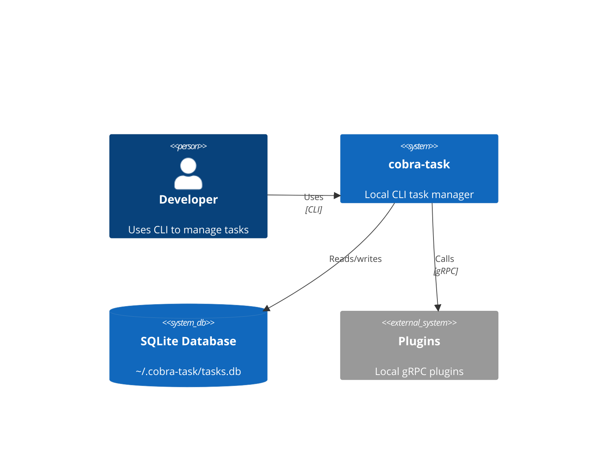
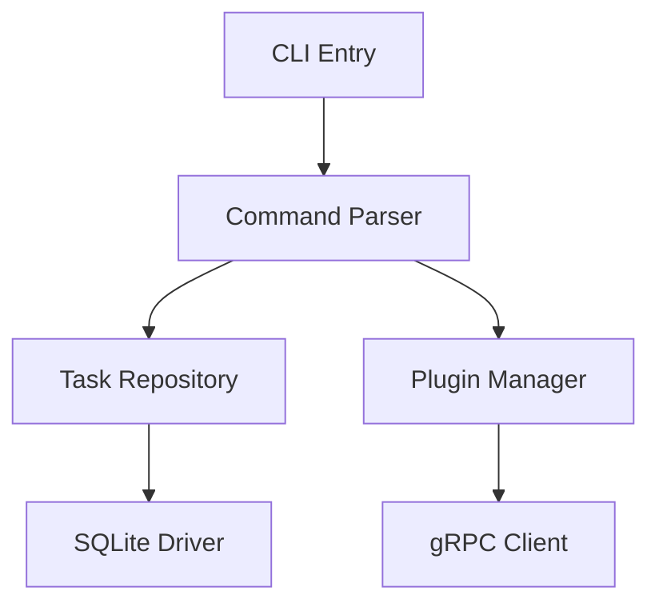


Good architecture documentation makes the difference between a project contributors can ramp up on in a day versus one that takes a week of reading source code. AI tools have made generating this documentation faster, but the quality depends on what you provide as input and which tool you use. This guide focuses on creating C4 diagrams, component overviews, and API architecture docs for open source projects.

## What Architecture Documentation Needs to Cover

Useful architecture docs for an open source project include: a system context diagram showing what the project does and its external dependencies; a container/component breakdown showing major subsystems; key data flows for the most important use cases; and a decision log explaining why the major design choices were made.

AI tools can generate all of this — with different levels of quality and different input requirements.

Good architecture docs also need to answer the questions a new contributor will have before reading a single line of code: What does this project do? How is it deployed? Which component handles which concern? Where do I start if I want to add a feature? When the documentation answers these questions, contributors spend their time contributing rather than reverse-engineering.

## Claude: Best for Narrative Architecture Docs

Claude produces high-quality narrative architecture documentation when given the repository structure and key files. The approach that works best: provide the directory tree, main entry point, and 2-3 key files, then ask for architecture documentation in a specific format.

**Prompt template:**

```
Here is the structure of an open source project:
[paste tree output]

Here are the key files:
[paste main.go / index.ts / app.py etc.]

Generate:
1. A one-paragraph system overview
2. A C4 context diagram in Mermaid syntax
3. A component breakdown table
4. Data flow for the main use case
```

**Example output for a Go CLI tool:**

```markdown
## System Overview
cobra-task is a CLI task manager that stores tasks in a local SQLite database.
It reads configuration from ~/.cobra-task/config.yaml and supports plugins
via a local gRPC interface. External dependencies: none required beyond the
local filesystem.

## C4 Context Diagram

```

Claude handles Go, Python, TypeScript, and Rust projects well. For large repositories (100+ files), focus Claude on the core packages rather than the full tree.

When working with larger codebases, a useful technique is to run `tree -L 3 --gitignore` to get the directory structure and include just that, along with 2-3 files that represent the core logic. Claude extrapolates the full architecture from these inputs accurately for well-structured projects. For projects with unusual organization, add a brief note explaining the layout convention.

## Generating Architecture Decision Records With Claude

Architecture Decision Records (ADRs) document why choices were made — not just what was chosen. They are invaluable for open source projects because they explain trade-offs to contributors who might otherwise re-open the same debates.

Claude generates ADRs effectively from code and comments:

```
Given this codebase uses SQLite instead of PostgreSQL (see config.go and
db/driver.go), generate an Architecture Decision Record explaining the
likely reasoning. The project is a developer CLI tool. Use the MADR format.
```

Claude output (MADR format):

```markdown
# Use SQLite as the Storage Backend

## Status
Accepted

## Context
cobra-task is a developer CLI tool installed per-user on a local machine.
It needs persistent storage for task data but has no server component and
no multi-user requirement.

## Decision
Use SQLite via the `modernc.org/sqlite` pure-Go driver (no CGo dependency).

## Consequences
- **Positive:** No external dependencies; zero setup for end users; single-file
  database easy to back up and inspect.
- **Positive:** Pure-Go driver means cross-platform builds without CGo.
- **Negative:** Cannot support concurrent writes from multiple processes; not
  suitable if the project later adds a daemon mode.
- **Neutral:** `modernc.org/sqlite` is slightly slower than CGo SQLite for
  large datasets, which is acceptable for task management use cases.
```

This ADR format is compact and readable. Claude generates accurate ADRs when you provide both the code and the context (what kind of project it is, who uses it).

## GitHub Copilot: Best for Inline Documentation

Copilot works best for inline code documentation — JSDoc, Go doc comments, Python docstrings — rather than high-level architecture docs. For architecture documentation specifically, you need to initiate the content and let Copilot complete or expand it.

```typescript
// Copilot autocompletes architectural comments effectively:
/**
 * AuthService handles all authentication flows including:
 * - JWT token generation and validation
 * - OAuth2 integration with GitHub and Google
 * - Session management with Redis backing
 *
 * @see {@link TokenValidator} for token verification logic
 * @see {@link OAuthProvider} for third-party auth flows
 */
class AuthService {
```

For a C4 diagram or component overview, Copilot does not have enough project-wide context to generate accurate diagrams independently. Use it for inline documentation within files, not for cross-cutting architecture docs.

Copilot's inline documentation quality is high for well-typed languages. In Go and TypeScript especially, it reads the type signatures and generates accurate parameter descriptions, error conditions, and usage examples without prompting. For architecture-level docs, switch to Claude.

## Mermaid AI and Eraser.io: Diagram-Focused Tools

For visual architecture diagrams specifically, Mermaid AI (mermaid.live with AI features) and Eraser.io provide diagram-focused generation with better tooling than asking Claude to output Mermaid syntax.

```bash
# Eraser.io workflow:
# 1. Describe your architecture in plain English
# 2. Eraser generates C4, sequence, and ER diagrams
# 3. Export as SVG/PNG or embed as live diagrams
```

The advantage over Claude: Eraser maintains the diagram as an editable artifact you can update iteratively. The disadvantage: it does not understand your code, only what you describe to it.

For sequence diagrams documenting API flows, Eraser.io is particularly useful. Describe the request/response flow in plain English and Eraser generates a Mermaid sequence diagram that you can embed in your docs. This is faster than hand-writing Mermaid sequence syntax, which is verbose.

## Workflow: Claude + Mermaid for OSS Projects

The most effective workflow for open source architecture documentation:

1. Use Claude to generate the text — system overview, component descriptions, decision rationale
2. Have Claude output Mermaid diagram syntax
3. Paste into mermaid.live to render and adjust visually
4. Embed the final Mermaid code blocks directly in your `ARCHITECTURE.md`

```markdown
# ARCHITECTURE.md template (Claude-generated, Mermaid diagrams)

## Overview
[Claude-generated paragraph]

## Component Diagram


## Data Flow: Creating a Task
[Claude-generated numbered steps]

## Key Design Decisions
[Claude-generated ADR summaries]
```

This produces documentation that is easy to update: re-run Claude with updated code, replace sections, re-render diagrams.

## Automating Documentation Updates in CI

Architecture docs go stale when code changes. A GitHub Actions workflow that flags documentation drift:

```yaml
# .github/workflows/architecture-check.yml
name: Architecture Check
on:
  pull_request:
    paths:
      - 'src/**'
      - 'cmd/**'
      - 'internal/**'

jobs:
  check-docs:
    runs-on: ubuntu-latest
    steps:
      - uses: actions/checkout@v4
      - name: Check ARCHITECTURE.md exists and is recent
        run: |
          if [ ! -f ARCHITECTURE.md ]; then
            echo "::warning::ARCHITECTURE.md is missing"
          fi
          # Check if architecture doc is older than 90 days without update
          LAST_MODIFIED=$(git log -1 --format="%ct" -- ARCHITECTURE.md)
          NOW=$(date +%s)
          AGE=$(( (NOW - LAST_MODIFIED) / 86400 ))
          if [ "$AGE" -gt 90 ]; then
            echo "::warning::ARCHITECTURE.md has not been updated in $AGE days"
          fi
```

This does not auto-update the docs — that is fragile and produces low-quality output. Instead it flags PRs that change core code without touching the architecture doc, prompting maintainers to update manually (using Claude) when needed.

## Comparison

| Use Case | Best Tool |
|---|---|
| Narrative architecture overview | Claude |
| C4 context and container diagrams | Claude + Mermaid |
| Inline code documentation | GitHub Copilot |
| Visual diagram editor | Eraser.io |
| ARCHITECTURE.md for OSS project | Claude |
| Keeping docs in sync with code | Claude (re-run on PR) |
| Architecture Decision Records | Claude |
| Sequence diagrams for API flows | Eraser.io or Claude |

## Frequently Asked Questions

**How do I keep architecture docs up to date?**

Run Claude against your updated code on major PRs or at each release. Ask it to identify what changed from the previous architecture description. Auto-updating every commit is usually too noisy; major releases are the right cadence.

**What should I include in ARCHITECTURE.md for an open source project?**

Cover: why the project exists, what problem it solves, the major components and their responsibilities, how data flows through the system for the main use case, and what was intentionally not included in scope. Skip low-level implementation details that belong in code comments.

**How much context does Claude need to generate accurate architecture docs?**

For a project up to 50 files, providing the directory tree and 3-5 key files (entry point, main data model, primary service) is sufficient. For larger projects, organize your input by subsystem: provide the tree and the key file for each subsystem. Claude produces better output with focused, organized input than with a dump of 100 files.

**Should architecture documentation live in the repo or in a wiki?**

In the repo. Wiki pages drift out of sync because they are not part of the PR process. Keeping `ARCHITECTURE.md` in the repository means it is reviewed with code changes and stays version-controlled with the code it describes.

## Related Articles

- [AI Assistants for Creating Security Architecture Review Documentation](/ai-assistants-for-creating-security-architecture-review-docu/)
- [Best AI Assistant for Generating Open Source Release Announcements](/best-ai-assistant-for-generating-open-source-release-announcements/)

