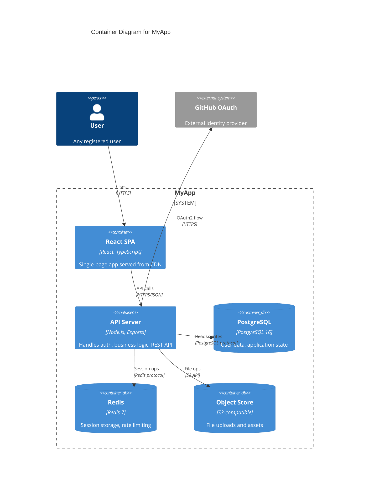

## Generating C4 Diagrams with Claude

C4 diagrams (Context, Container, Component, Code) are the most practical architecture documentation format for open source projects. Claude can generate PlantUML or Mermaid C4 diagrams from a description of your system.

**Prompt pattern:**
```
Generate a C4 Container diagram in Mermaid for this system:
- A React SPA (users' browser)
- A Node.js API server (Express, handles auth and business logic)
- A PostgreSQL database (user data, application state)
- A Redis cache (session storage, rate limiting)
- An S3-compatible object store (file uploads)
- External: GitHub OAuth (authentication)

Users interact with the SPA. The API authenticates via GitHub OAuth.
The API reads/writes PostgreSQL, caches sessions in Redis, stores files in S3.
```

Claude output:



Add this to your `docs/architecture.md` and it renders automatically on GitHub.

---

## Generating API Reference Documentation from Code

For open source projects, Claude can generate API reference documentation directly from your source code. Feed it your route definitions and type annotations:

```bash
# Extract all Express routes for documentation
grep -rn "router\.\(get\|post\|put\|patch\|delete\)" src/routes/ | \
  grep -v "test\|spec" > /tmp/routes.txt

# Then paste into Claude with:
# "Generate Markdown API reference documentation for these routes.
#  Include: endpoint, method, path params, query params, request body, responses."
```

For TypeScript projects, Claude can use your type definitions to generate accurate request/response schemas:

```typescript
// Claude reads this interface and generates the docs entry
export interface CreateRepoRequest {
  name: string;           // Repository name (alphanumeric, hyphens allowed)
  description?: string;   // Optional project description
  private: boolean;       // Whether the repo is private
  defaultBranch?: string; // Default: "main"
}
```

---

## Architecture Decision Records (ADRs) with AI Assistance

ADRs document why architectural decisions were made. Claude can draft ADRs from a brief description of the problem and decision:

**Prompt:**
```
Write an Architecture Decision Record for this decision:
Problem: We need to choose a caching strategy for API responses.
Decision: Use Redis with a TTL-based cache invalidation strategy (not event-driven).
Reason: Our data updates are infrequent (< 10 writes/hour) and our team lacks
the infrastructure to manage a message broker for cache invalidation events.
Trade-offs: Occasional stale data (max TTL=60s), simpler operations.
```

Claude produces a properly formatted ADR with Status, Context, Decision, Consequences, and Alternatives Considered sections. Store these in `docs/adr/` numbered sequentially — GitHub renders them automatically and they become the canonical record of your architecture's evolution.

---

## Frequently Asked Questions

**Who is this article written for?**

This article is written for developers, technical professionals, and power users who want practical guidance. Whether you are evaluating options or implementing a solution, the information here focuses on real-world applicability rather than theoretical overviews.

**How current is the information in this article?**

We update articles regularly to reflect the latest changes. However, tools and platforms evolve quickly. Always verify specific feature availability and pricing directly on the official website before making purchasing decisions.

**Are there free alternatives available?**

Free alternatives exist for most tool categories, though they typically come with limitations on features, usage volume, or support. Open-source options can fill some gaps if you are willing to handle setup and maintenance yourself. Evaluate whether the time savings from a paid tool justify the cost for your situation.

**How do I get started quickly?**

Pick one tool from the options discussed and sign up for a free trial. Spend 30 minutes on a real task from your daily work rather than running through tutorials. Real usage reveals fit faster than feature comparisons.

**What is the learning curve like?**

Most tools discussed here can be used productively within a few hours. Mastering advanced features takes 1-2 weeks of regular use. Focus on the 20% of features that cover 80% of your needs first, then explore advanced capabilities as specific needs arise.

## Related Articles

- [Best AI Assistant for Creating Open Source Project Branding](/ai-tools-compared/best-ai-assistant-for-creating-open-source-project-branding-/)
- [AI Assistants for Creating Security Architecture Review.](/ai-tools-compared/ai-assistants-for-creating-security-architecture-review-docu/)
- [AI Tools for Analyzing Which Open Source Issues Would Benefi](/ai-tools-compared/ai-tools-for-analyzing-which-open-source-issues-would-benefi-from-contributions/)
- [Best AI Assistant for Drafting Open Source Partnership and](/ai-tools-compared/best-ai-assistant-for-drafting-open-source-partnership-and-integration-proposals-2026/)
- [Best AI Assistant for Generating Open Source Release](/ai-tools-compared/best-ai-assistant-for-generating-open-source-release-announcements/)

Built by theluckystrike — More at [zovo.one](https://zovo.one)
```
```

