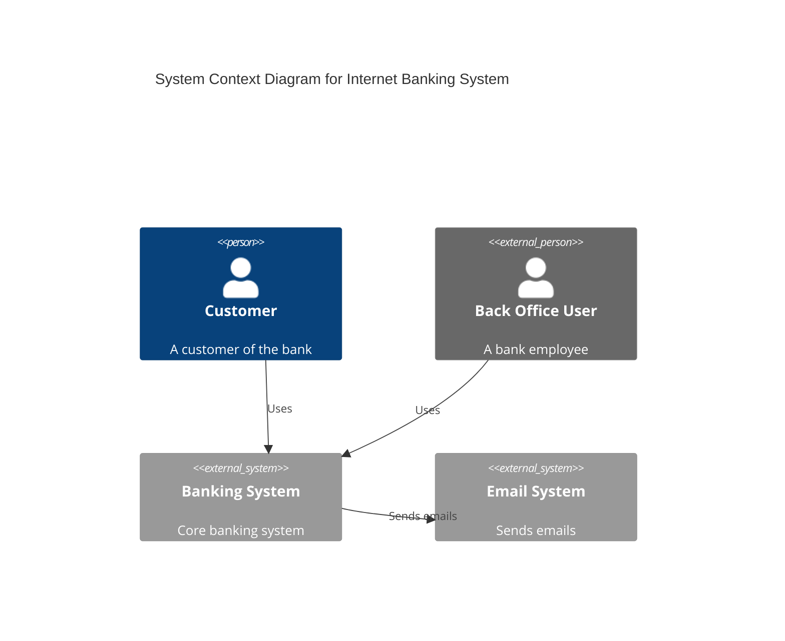
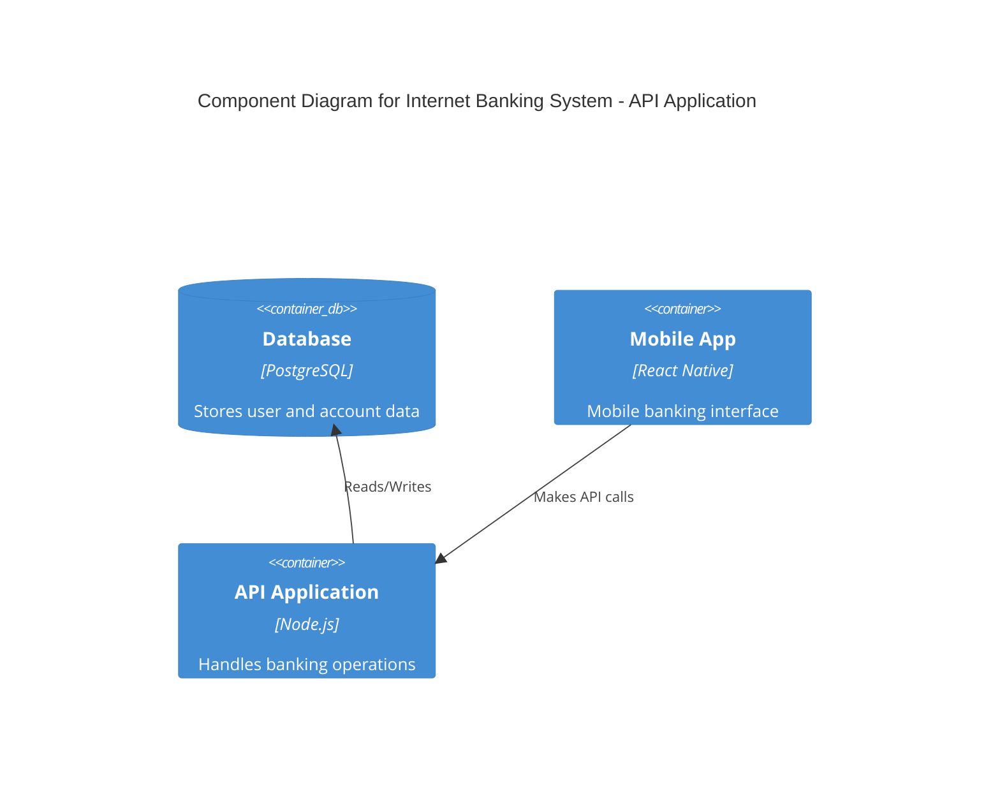
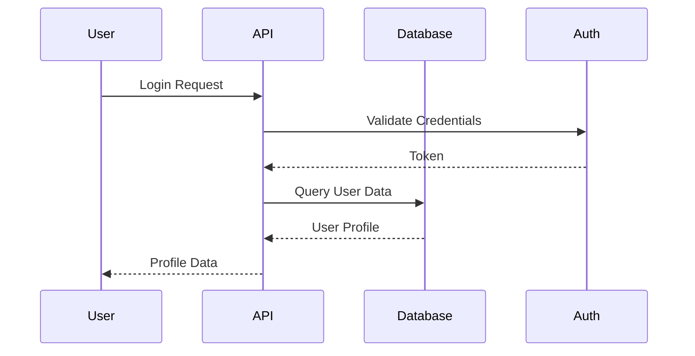



Claude stands out as the best choice for generating open source project architecture documentation because it produces comprehensive C4 models, API specifications, component diagrams, and decision records that clearly communicate system design to both technical contributors and stakeholders. It understands architectural patterns, can output multiple documentation formats, and maintains consistency across complex multi-service projects.

## Why AI Assistants Matter for Architecture Documentation

Open source projects often struggle with keeping architecture documentation current. New contributors need clear diagrams and explanations to understand the system quickly, but maintaining these documents manually takes significant effort. AI assistants can generate initial architecture documentation that you can refine, transforming what would be hours of diagramming and writing into minutes of AI-assisted creation and review.

The best AI tools for this task understand software architecture patterns, can output various diagram formats (Mermaid, PlantUML, Graphviz), and help maintain documentation as your system evolves.

## Top AI Assistants for Architecture Documentation

### 1. Claude (via API or Claude Code)

Claude excels at generating comprehensive architecture documentation including C4 models, API specifications, database schemas, and decision records. It can produce multiple output formats and understands complex architectural patterns.

**Strengths:**
- Generates complete C4 model diagrams (Context, Container, Component, Code)
- Creates API documentation with request/response examples
- Outputs Mermaid, PlantUML, and Graphviz diagrams
- Understands microservices, monoliths, and hybrid architectures
- Can generate Architecture Decision Records (ADRs)

**Example prompt:**
```
Create C4 model documentation for an e-commerce system with:
- User-facing web application (React)
- Mobile app (React Native)
- API Gateway
- User service, Product service, Order service (Node.js)
- PostgreSQL database
- Redis cache
- Message queue for async processing
Include Mermaid diagrams for each level and API contracts for each service.
```

Claude produces well-organized documentation with clear explanations of component responsibilities, data flow, and integration points.

### 2. GitHub Copilot

Copilot works well when you're already in your IDE writing documentation files. It excels at generating Markdown documentation, API specs in OpenAPI format, and code comments that explain architecture.

**Strengths:**
- Inline completion while writing README files
- Quick generation of OpenAPI/Swagger specifications
- Integrates with existing codebase context
- Good for adding documentation to existing code

**Example workflow:**
```yaml
# Start typing this comment and Copilot suggests the full OpenAPI spec
openapi: 3.0.0
info:
  title: E-Commerce API
  version: 1.0.0
paths:
  /products:
    get:
      summary: List products
      parameters:
        - name: category
          in: query
          schema:
            type: string
      responses:
        '200':
          description: Successful response
          content:
            application/json:
              schema:
                type: array
                items:
                  $ref: '#/components/schemas/Product'
```

Copilot is most effective when you provide partial documentation or clear comments describing what you need.

### 3. Cursor

Cursor combines AI assistance with whole-file awareness, making it useful for generating complete architecture documentation across multiple files and formats.

**Strengths:**
- Multi-file generation in one pass
- Can create README sections, architecture decision records, and API docs
- Agent mode for complex documentation generation
- Maintains consistency across generated files

**Example workflow:**
```
Use Cursor to generate:
1. ARCHITECTURE.md with system overview and component diagram
2. API.md with all endpoints and response schemas
3. database/schema.md with ERD and table definitions
4. ADR/ directory with initial architecture decisions
```

Cursor handles coordination across files better than inline-only tools.

### 4. ChatGPT

ChatGPT provides quick responses for brainstorming architecture and generating initial documentation drafts. It's useful for getting started quickly.

**Strengths:**
- Fast initial responses for brainstorming
- Good for generating templates and outlines
- Can explain architectural patterns in plain language
- Useful for creating documentation structure

**Example workflow:**
```
Prompt: "Generate an architecture overview for a real-time collaboration tool with WebSocket support, document storage, and user authentication. Include components, data flow, and technology recommendations."
```

ChatGPT is best for quick drafts andIterative refinement rather than complete documentation generation.

## Comparison Table

| Feature | Claude | Copilot | Cursor | ChatGPT |
|---------|--------|---------|--------|---------|
| C4 Models | ✅ | ❌ | ✅ | ✅ |
| Mermaid Diagrams | ✅ | ❌ | ✅ | ✅ |
| OpenAPI Specs | ✅ | ✅ | ✅ | ✅ |
| ADRs | ✅ | ❌ | ✅ | ✅ |
| Database Schemas | ✅ | ✅ | ✅ | ✅ |
| Multi-file Output | ✅ | ❌ | ✅ | ❌ |
| Code Context | ✅ | ✅ | ✅ | ❌ |

## Generating Architecture Diagrams

### C4 Model with Mermaid

Claude can generate complete C4 model diagrams:



### Component Diagram



### Sequence Diagram



## Creating API Documentation

Claude can generate comprehensive API docs:

```markdown
# Payment Service API

## Endpoints

### Create Payment
`POST /api/v1/payments`

**Request:**
```json
{
  "amount": 99.99,
  "currency": "USD",
  "customerId": "cus_123",
  "paymentMethod": "card",
  "metadata": {
    "orderId": "ord_456"
  }
}
```

**Response:**
```json
{
  "id": "pay_789",
  "status": "pending",
  "createdAt": "2024-01-15T10:30:00Z"
}
```

**Error Codes:**
- `400`: Invalid request body
- `401`: Unauthorized
- `402`: Payment failed
- `429`: Rate limited
```

## Generating Database Schemas

Claude can create database documentation:

```markdown
# Database Schema

## Users Table

| Column | Type | Constraints | Description |
|--------|------|-------------|-------------|
| id | UUID | PK | Unique identifier |
| email | VARCHAR(255) | UNIQUE, NOT NULL | User email |
| password_hash | VARCHAR(255) | NOT NULL | Bcrypt hash |
| created_at | TIMESTAMP | DEFAULT NOW() | Creation time |
| updated_at | TIMESTAMP | | Last update time |

## Indexes
- `idx_users_email` on `email`
- `idx_users_created_at` on `created_at`

## Relationships
- One User has many Orders
- One User has many Payments
```

## Architecture Decision Records

Claude can generate ADRs:

```markdown
# ADR-001: Use PostgreSQL as Primary Database

## Status
Accepted

## Context
We need to choose a database for our application.

## Decision
We will use PostgreSQL as our primary database.

## Consequences
### Positive
- ACID compliance
- Rich JSON support
- Strong community

### Negative
- Requires more resources than SQLite
- More complex setup
```

## Choosing the Right Tool

For **comprehensive architecture documentation** with C4 models and multiple diagram types, Claude provides the most thorough output.

For **inline API documentation** while coding, GitHub Copilot works best when you're actively writing code.

For **multi-file documentation projects**, Cursor coordinates generation across files effectively.

For **quick brainstorming and drafts**, ChatGPT offers fast feedback on architecture directions.

Consider your workflow: if you spend hours manually creating architecture diagrams and documentation, AI assistants can reduce this to minutes of generation plus refinement time.

## Best Practices

1. **Verify architectural accuracy**: AI generates starting points based on patterns it knows. Always validate that the suggested architecture matches your actual system.

2. **Keep diagrams in sync**: Store diagrams as code (Mermaid, PlantUML) in version control so changes can be tracked and reviewed.

3. **Iterate rather than accept first output**: AI generates initial documentation, not final architecture. Review and adjust to match your system's specifics.

4. **Document decisions**: Use AI to generate Architecture Decision Records that capture why certain choices were made.

5. **Version your documentation**: Keep architecture docs in the same repository as your code so they evolve together.

6. **Include context**: The more specific your prompts about your actual technology stack, the better the generated documentation.

7. **Review accessibility**: Ensure generated diagrams have proper labels and can be understood by both technical and non-technical stakeholders.

---


## Related Reading

- [AI Tools Guides Hub](/ai-tools-compared/guides-hub/)

Built by theluckystrike — More at [zovo.one](https://zovo.one)

