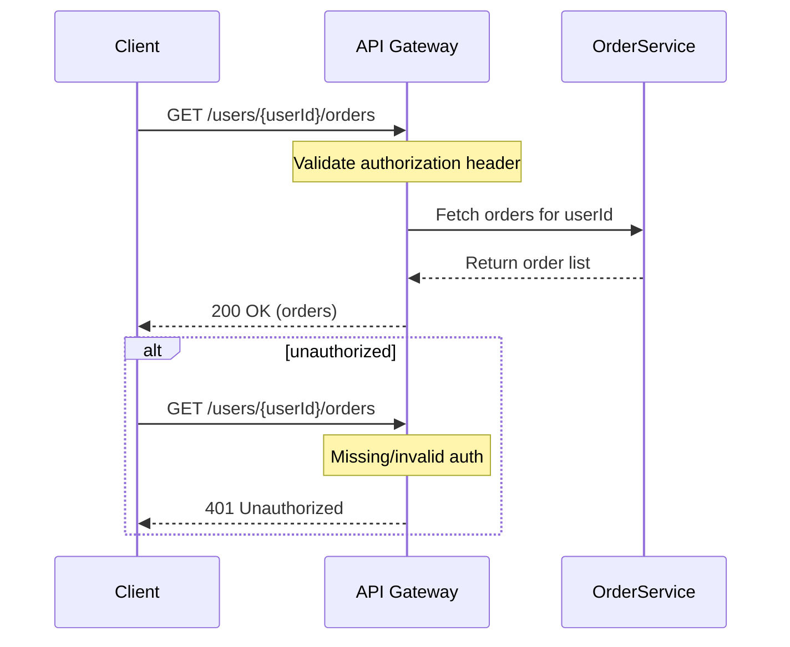
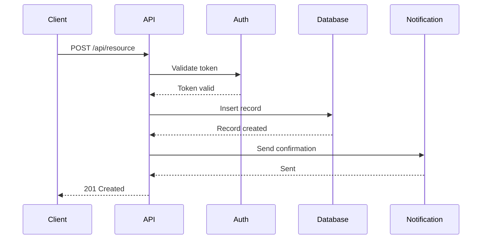
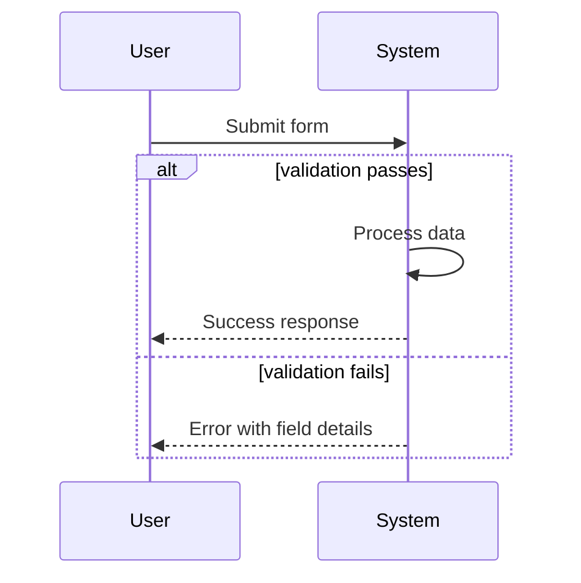



Mermaid sequence diagrams help developers visualize API interactions, document system behavior, and communicate architecture decisions. Manually creating these diagrams from endpoint documentation requires translating descriptions into Mermaid syntax—a repetitive task that consumes time better spent on development work. AI tools now handle this translation automatically, converting natural language endpoint descriptions into clean, renderable Mermaid code.

This guide shows you how to use AI to generate Mermaid sequence diagrams from API endpoint descriptions, covering practical workflows, prompt strategies, and tools that excel at this task.

## Why Generate Sequence Diagrams with AI

API documentation typically describes endpoints in OpenAPI format, plain English, or structured formats like Postman collections. Converting these descriptions into visual sequence diagrams requires understanding actor roles, request-response flows, and potential branching logic.

AI tools interpret endpoint descriptions and produce Mermaid syntax without manual translation. This approach offers several advantages:

- Speed: Generate diagrams in seconds instead of minutes

- Consistency: Standardized diagram structure across all endpoints

- Iteration: Quickly regenerate diagrams when API designs change

- Accuracy: Reduce human error in syntax construction

The process works best when your endpoint descriptions include sufficient context about actors, authentication, and data flow.

## Prerequisites

Before you begin, make sure you have the following ready:

- A computer running macOS, Linux, or Windows
- Terminal or command-line access
- Administrator or sudo privileges (for system-level changes)
- A stable internet connection for downloading tools


### Step 1: Converting OpenAPI Specifications to Mermaid

OpenAPI specifications contain endpoint information that AI tools can parse and convert. When you provide an OpenAPI spec (JSON or YAML), AI assistants extract the relevant details and generate corresponding sequence diagrams.

Consider this simplified OpenAPI endpoint description:

```yaml
/users/{userId}/orders:
  get:
    summary: Get user orders
    parameters:
      - name: userId
        in: path
        required: true
        schema:
          type: integer
      - name: authorization
        in: header
        required: true
    responses:
      200:
        description: Order list retrieved
      401:
        description: Unauthorized
```

An AI tool converts this into Mermaid syntax:



This conversion captures the main request flow and error path. The resulting diagram renders immediately in GitHub Markdown, documentation sites, or Mermaid viewers.

### Step 2: Effective Prompt Strategies

AI-generated diagram quality depends significantly on how you structure prompts. Clear, specific descriptions produce better results than vague requests.

### Include Essential Elements

Your prompt should specify:

- Actors involved: Which systems or users participate in the interaction

- Request sequence: The order of API calls and responses

- Authentication flow: How identity is verified (tokens, API keys, sessions)

- Data flow: What information passes between components

- Error scenarios: Alternative paths for failure cases

### Example Prompt Structure

```
Convert this endpoint description to a Mermaid sequence diagram:

Endpoint: POST /api/checkout
Description: Initiates checkout process for authenticated users
Steps:
1. Client sends cart data with payment token
2. Server validates payment with payment provider
3. Server creates order in database
4. Server decrements inventory
5. Server returns order confirmation

Show success and failure paths for payment validation.
```

This structured prompt gives the AI complete context for generating an accurate diagram.

### Step 3: Tools That Excel at Diagram Generation

Several AI coding assistants handle Mermaid generation effectively. Each offers distinct advantages depending on your workflow.

### Claude Code

Claude Code generates Mermaid diagrams through conversational interaction. Describe your API endpoints in plain language, and Claude produces the corresponding syntax. It handles complex flows with multiple actors and conditional branches.

To use Claude Code, provide your endpoint description and request Mermaid output explicitly:

```
Generate a Mermaid sequence diagram for this API flow. Output only the Mermaid syntax.
```

Claude maintains conversation context, allowing you to refine diagrams through follow-up requests.

### Cursor

Cursor provides AI-assisted coding with full project context. When working within a repository containing API documentation or OpenAPI specs, Cursor understands the surrounding code structure and generates diagrams aligned with your project's architecture.

Cursor works well when you want to generate diagrams as part of a larger documentation workflow, keeping all related files accessible in the same IDE session.

### GitHub Copilot

Copilot suggests code completions including Mermaid syntax within Markdown files. While less interactive than Claude or Cursor, Copilot works well when you already have endpoint descriptions written in comments or documentation blocks adjacent to your Markdown.

### Step 4: Workflow Integration

Integrating AI-generated diagrams into your documentation workflow maximizes their value. Consider these practical approaches.

### Documentation Automation

Store API endpoint descriptions in version-controlled files (OpenAPI specs, Markdown files, or dedicated documentation). Regenerate Mermaid diagrams whenever endpoint definitions change. This automation ensures documentation stays synchronized with implementation.

### Review and Refinement

AI-generated diagrams serve as starting points. Review each diagram for accuracy—verify that actor roles, data fields, and response codes match your actual implementation. Small adjustments often improve clarity without requiring complete regeneration.

### Collaboration Benefits

Sequence diagrams created from AI output communicate API behavior effectively to team members who prefer visual representations over text documentation. Share generated diagrams in pull requests, technical specifications, or onboarding materials.

### Step 5: Handling Complex API Flows

Real-world APIs often involve more complexity than simple request-response pairs. AI tools handle various scenarios when prompted appropriately.

### Nested Operations

APIs with microservice architectures involve multiple downstream calls. Describe the full call chain:



AI converts descriptions of these multi-service interactions into properly structured diagrams showing parallel operations and service dependencies.

### Conditional Logic

API responses often depend on business rules. Include conditional paths in your descriptions:



### Step 6: Practical Tips

Several techniques improve diagram generation results:

1. Provide complete context: Include authentication, headers, and query parameters in descriptions

2. Specify diagram type: Request "sequence diagram" explicitly in prompts

3. Iterate refinement: Generate an initial diagram, then request specific modifications

4. Use consistent naming: Establish conventions for actor names used across multiple diagrams

## Troubleshooting

**Configuration changes not taking effect**

Restart the relevant service or application after making changes. Some settings require a full system reboot. Verify the configuration file path is correct and the syntax is valid.

**Permission denied errors**

Run the command with `sudo` for system-level operations, or check that your user account has the necessary permissions. On macOS, you may need to grant terminal access in System Settings > Privacy & Security.

**Connection or network-related failures**

Check your internet connection and firewall settings. If using a VPN, try disconnecting temporarily to isolate the issue. Verify that the target server or service is accessible from your network.


## Frequently Asked Questions

**How long does it take to generate mermaid sequence diagrams from api endpoint?**

For a straightforward setup, expect 30 minutes to 2 hours depending on your familiarity with the tools involved. Complex configurations with custom requirements may take longer. Having your credentials and environment ready before starting saves significant time.

**What are the most common mistakes to avoid?**

The most frequent issues are skipping prerequisite steps, using outdated package versions, and not reading error messages carefully. Follow the steps in order, verify each one works before moving on, and check the official documentation if something behaves unexpectedly.

**Do I need prior experience to follow this guide?**

Basic familiarity with the relevant tools and command line is helpful but not strictly required. Each step is explained with context. If you get stuck, the official documentation for each tool covers fundamentals that may fill in knowledge gaps.

**Can I adapt this for a different tech stack?**

Yes, the underlying concepts transfer to other stacks, though the specific implementation details will differ. Look for equivalent libraries and patterns in your target stack. The architecture and workflow design remain similar even when the syntax changes.

**Where can I get help if I run into issues?**

Start with the official documentation for each tool mentioned. Stack Overflow and GitHub Issues are good next steps for specific error messages. Community forums and Discord servers for the relevant tools often have active members who can help with setup problems.

## Related Articles

- [How to Use AI to Generate Activity Diagrams from User](/how-to-use-ai-to-generate-activity-diagrams-from-user-acceptance-criteria/)
- [How to Use AI to Generate Component Diagrams from React](/how-to-use-ai-to-generate-component-diagrams-from-react-or-v/)
- [How to Use AI Multi File Context to Generate Consistent API](/how-to-use-ai-multi-file-context-to-generate-consistent-api-endpoints/)
- [How to Use AI to Generate Jest Tests for Next.js API Routes](/how-to-use-ai-to-generate-jest-tests-for-nextjs-api-routes/)
- [How to Use AI to Generate Pagination Edge Case Tests for API](/how-to-use-ai-to-generate-pagination-edge-case-tests-for-api/)

Built by theluckystrike — More at [zovo.one](https://zovo.one)
```
```

