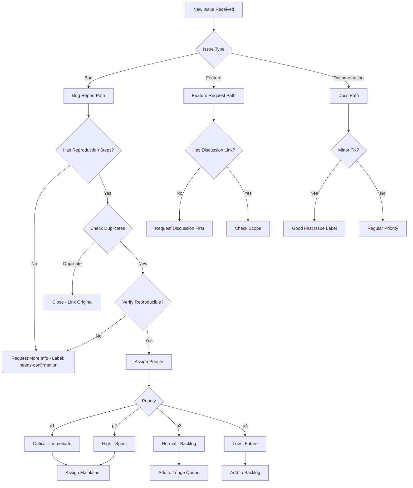




GitHub issue triage is often the first point of contact between maintainers and potential contributors. For new maintainers taking over a project or those managing growing open source repositories, establishing a clear triage workflow prevents bottlenecks, reduces contributor frustration, and ensures bugs receive appropriate attention. AI tools can accelerate the creation of these flowcharts significantly, transforming what might be hours of diagramming into a structured conversation that produces actionable results.


## Understanding the Triage Workflow Requirements


Before generating any flowchart, you need to articulate the decision points that govern your triage process. A typical GitHub issue triage workflow involves several key stages: initial categorization, severity assessment, priority determination, and routing to the appropriate channel or maintainer.


Consider the questions your team asks when a new issue arrives:


- Is this a bug report, feature request, or question?

- Does the issue contain sufficient information to be actionable?

- What is the scope of impact—is it a critical production issue or a minor cosmetic problem?

- Who should handle this—an existing maintainer, a new contributor, or the community at large?

- Should this be marked for a specific milestone or version?


These questions form the nodes and branches of your flowchart. AI tools excel at translating these decision trees into visual diagrams, especially when you provide clear prompts describing your existing process.


## Generating Flowcharts with AI


Modern AI coding assistants and chat tools can generate flowchart definitions in formats like Mermaid.js, which GitHub renders natively in Markdown files. This makes Mermaid an ideal output format since it integrates directly into your repository's documentation.


When prompting an AI tool, structure your request to include the specific issue types your project handles, the information required for each category, and the escalation paths. Here's a practical example of how to frame your prompt:


**Effective prompt template:**


> "Create a Mermaid.js flowchart for GitHub issue triage in an open source JavaScript project. The workflow should handle bug reports, feature requests, and documentation improvements. Bugs require steps to verify reproducibility and check for duplicate reports. Feature requests need a discussion thread check and category assignment (enhancement, new feature, refactoring). Documentation issues route to a separate docs repo. Include decision nodes for closing invalid issues, marking needs-confirmation, and assigning priority labels (p1-critical, p2-high, p3-normal, p4-low)."


The AI will generate Mermaid syntax that you can immediately drop into your documentation:





## Customizing for Your Project Size


Small projects with a handful of contributors need simpler workflows than large enterprise open source projects. Adjust your AI prompts based on your actual operational needs.


**For small projects (1-5 maintainers):**


- Focus on basic categorization (bug vs feature vs question)

- Include a "wontfix" path for out-of-scope items

- Route everything to a single triage queue rather than individual assignees


**For medium projects (5-20 maintainers):**


- Add specialized paths for different subsystems (frontend, backend, documentation)

- Include a "needs-design-review" branch for UI/UX changes

- Add security issue handling with private reporting paths


**For large projects (20+ maintainers):**


- Add triager role assignments

- Include paths for community contributors vs core team

- Add milestone and release tracking integration

- Include trademark/license compliance checks


Your AI prompt should explicitly state your project scale so the generated flowchart matches your operational reality.


## Integrating Labels and Automation


Effective triage flowcharts should reference GitHub Labels and automation tools. Include these details in your AI prompts for more actionable outputs:


**Label integration example:**


```
When generating, include these GitHub labels:
- bug, enhancement, documentation, question
- needs-confirmation, needs-reproduction, needs-design
- good-first-issue (for small tasks welcoming new contributors)
- priority/critical, priority/high, priority/medium, priority/low
- help-wanted, triage/accepted
```


**Automation hooks:**


GitHub Actions can automate parts of your triage workflow. Consider generating automation code alongside your flowchart:


```yaml
# Example: Auto-label new issues based on keywords
name: Issue Triage
on:
  issues:
    types: [opened, edited]

jobs:
  label:
    runs-on: ubuntu-latest
    steps:
      - uses: actions/github-script@v7
        with:
          script: |
            const issue = context.issue;
            const labels = [];
            
            if (issue.body.toLowerCase().includes('bug') || 
                issue.body.toLowerCase().includes('error') ||
                issue.body.toLowerCase().includes('crash')) {
              labels.push('bug');
            }
            if (issue.body.toLowerCase().includes('feature') ||
                issue.body.toLowerCase().includes('would be nice')) {
              labels.push('enhancement');
            }
            if (labels.length > 0) {
              github.rest.issues.addLabels({
                owner: context.repo.owner,
                repo: context.repo.repo,
                issue_number: issue.number,
                labels: labels
              });
            }
```


## Maintaining and Evolving Your Flowchart


Your triage flowchart is a living document. Set up a process to review and update it quarterly or whenever your contribution patterns change significantly. AI tools can help with this too—paste your existing Mermaid diagram and ask for modifications rather than starting from scratch.


Common evolution triggers include:


- New contribution categories (security issues, translation requests)

- Changes in team structure or responsibilities

- New automation that reduces manual decision points

- Feedback from new contributors about unclear processes


## Practical Implementation Steps


1. **Document your current informal process** - Write down the decisions you currently make when triaging issues, even if they're not written anywhere

2. **Generate an initial flowchart** - Use the prompt templates above with your specific project details

3. **Review with existing contributors** - Ask your current community what confusion points exist

4. **Integrate into documentation** - Place the flowchart in CONTRIBUTING.md or a dedicated TRIAGE.md file

5. **Link labels and automation** - Ensure every branch point has corresponding GitHub labels

6. **Test and iterate** - Use the flowchart for a month, then refine based on actual issues encountered


## Related Reading

- [Best AI Coding Assistants Compared](/ai-tools-compared/best-ai-coding-assistants-compared/)
- [Best AI Coding Assistant Tools Compared 2026](/ai-tools-compared/best-ai-coding-assistant-tools-compared-2026/)
- [AI Tools Guides Hub](/ai-tools-compared/guides-hub/)
- [How to Use AI to Create Milestone Planning Documents.](/ai-tools-compared/how-to-use-ai-to-create-milestone-planning-documents-from-is/)
- [Best AI for Writing Good First Issue Descriptions That.](/ai-tools-compared/best-ai-for-writing-good-first-issue-descriptions-that-attra/)
- [Best AI for Writing Good First Issue Descriptions That.](/ai-tools-compared/best-ai-for-writing-good-first-issue-descriptions-that-attract-new-contributors/)

Built by

Built by theluckystrike — More at [zovo.one](https://zovo.one)
