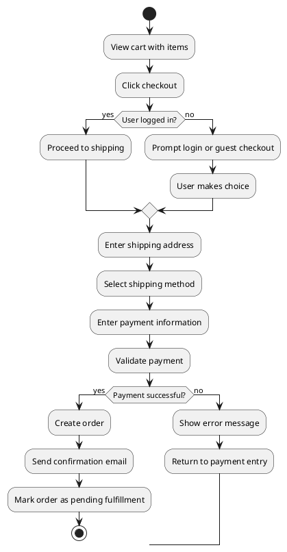



Activity diagrams serve as a powerful visualization tool for understanding business processes, user flows, and system behaviors. When working with user acceptance criteria (UAC), transforming textual requirements into clear activity diagrams helps teams validate understanding before implementation begins. AI tools can automate this conversion, saving significant time while ensuring consistency across your documentation.

This guide walks you through the process of generating activity diagrams from user acceptance criteria using AI coding assistants and specialized tools.

## Table of Contents

- [Why Generate Activity Diagrams from Acceptance Criteria](#why-generate-activity-diagrams-from-acceptance-criteria)
- [Tools for AI-Powered Activity Diagram Generation](#tools-for-ai-powered-activity-diagram-generation)
- [Step-by-Step Workflow](#step-by-step-workflow)
- [Practical Examples](#practical-examples)
- [Integrating Activity Diagrams into Development Workflow](#integrating-activity-diagrams-into-development-workflow)
- [Common Pitfalls and Solutions](#common-pitfalls-and-solutions)
- [Tips for Better Results](#tips-for-better-results)

## Why Generate Activity Diagrams from Acceptance Criteria

User acceptance criteria typically describe expected system behavior in structured text format. Converting these text descriptions into visual activity diagrams offers several advantages:

- Validation: Diagrams reveal gaps or ambiguities in acceptance criteria before development starts

- Communication: Stakeholders who struggle with textual requirements can review visual representations

- Documentation: Activity diagrams serve as living documentation of system behavior

- Testing: Clear flows help identify test cases and edge conditions

Manual diagram creation takes 15-30 minutes per user story. AI-assisted generation reduces this to seconds while maintaining accuracy.

## Tools for AI-Powered Activity Diagram Generation

Several AI tools can generate activity diagrams from natural language descriptions:

### Mermaid Live Editor with AI Assistance

Mermaid.js supports activity diagram syntax and integrates with AI tools through prompt engineering. Most major AI coding assistants can generate Mermaid syntax when provided with clear acceptance criteria.

### PlantUML with AI Generation

PlantUML offers activity diagram capabilities and works well with AI-generated code. Tools like Claude, ChatGPT, and Cursor can produce PlantUML markup from descriptions.

### Specialized UML Generation Tools

Some platforms offer direct AI-to-diagram conversion without requiring diagram syntax knowledge. These include tools integrated into documentation platforms and enterprise modeling software.

## Step-by-Step Workflow

### Step 1: Structure Your Acceptance Criteria

Before feeding acceptance criteria to AI, ensure they follow a structured format. Use the Given-When-Then (Gherkin) style or a simple numbered list format:

```
Scenario: User login flow
Given the user is on the login page
When the user enters valid credentials
Then the user should be redirected to the dashboard
And a session token should be created
```

### Step 2: Choose Your Output Format

Decide whether you want Mermaid or PlantUML output. Mermaid renders directly in GitHub, GitLab, and many documentation platforms. PlantUML offers more advanced formatting options and integrates with enterprise tools.

### Step 3: Craft the AI Prompt

The quality of your generated diagram depends heavily on your prompt. Here's an effective prompt structure:

```
Generate a Mermaid.js activity diagram from these acceptance criteria:

[Your acceptance criteria here]

Requirements:
- Use correct Mermaid activity diagram syntax
- Include start and end nodes
- Show decision points where applicable
- Represent parallel actions with fork/join notation
- Keep labels concise but descriptive
```

### Step 4: Review and Refine

AI-generated diagrams require human review. Check for:

- Missing decision branches

- Incorrect flow direction

- Ambiguous condition labels

- Edge cases not covered in original criteria

## Practical Examples

### Example 1: Simple Login Flow

**Acceptance Criteria:**

```
1. User enters username and password
2. System validates credentials
3. If valid, redirect to dashboard
4. If invalid, show error message and remain on login page
5. After 3 failed attempts, lock account for 15 minutes
```

**AI Prompt:**

```
Generate a Mermaid activity diagram for this user login flow acceptance criteria.
```

**Generated Output:**

```mermaid
activity TDU
    Start([Start]) --> EnterCredentials[Enter username and password]
    EnterCredentials --> Validate[System validates credentials]
    Validate --> Decision{Valid?}
    Decision -->|Yes| Redirect[Redirect to dashboard]
    Decision -->|No| ShowError[Show error message]
    ShowError --> IncrementCounter[Increment failed attempt counter]
    IncrementCounter --> CheckAttempts{Attempts >= 3?}
    CheckAttempts -->|Yes| LockAccount[Lock account for 15 minutes]
    CheckAttempts -->|No| EnterCredentials
    LockAccount --> End([End])
    Redirect --> End
```

### Example 2: E-Commerce Checkout Process

**Acceptance Criteria:**

```
Scenario: Complete checkout
1. User views cart with items
2. User clicks checkout
3. If user not logged in, prompt login or guest checkout
4. User enters shipping address
5. User selects shipping method
6. User enters payment information
7. System validates payment
8. If payment successful, create order and send confirmation
9. If payment fails, show error and return to payment entry
10. Order is marked as pending fulfillment
```

**AI Prompt:**

```
Generate a PlantUML activity diagram for an e-commerce checkout process.
Include:
- Login/guest checkout decision
- Shipping method selection
- Payment validation with success/failure paths
- Order creation on success
Use PlantUML syntax.
```

**Generated Output:**



## Integrating Activity Diagrams into Development Workflow

### Pre-Development Validation

Generate activity diagrams during sprint planning or refinement sessions. Share diagrams with product owners to confirm understanding before story point assignment.

### Documentation Automation

Store generated diagrams in your repository alongside acceptance criteria. Use CI/CD pipelines to render diagrams and include them in generated documentation sites.

### Test Case Identification

Review activity diagrams to identify:

- All possible paths through the flow

- Boundary conditions requiring testing

- Error handling scenarios

- Integration points with other systems

## Common Pitfalls and Solutions

### Pitfall 1: Over-Complex Diagrams

Problem: AI generates diagrams with too many branches, making them unreadable.

Solution: Break complex acceptance criteria into multiple diagrams. Focus on one scenario per diagram.

### Pitfall 2: Missing Edge Cases

Problem: Generated diagrams don't account for timeout, network failure, or data validation scenarios.

Solution: Add explicit prompts requesting error handling paths. Review against failure mode analysis.

### Pitfall 3: Incorrect Syntax

Problem: Generated diagram code contains syntax errors preventing rendering.

Solution: Use AI tools with code execution capabilities to validate syntax before saving. Test rendering in a preview environment.

## Tips for Better Results

1. Provide context: Include system name and primary actors in your prompt

2. Specify notation: Clearly state whether you want UML, Mermaid, or PlantUML syntax

3. Request specific elements: Ask for decision diamonds, parallel flows, or swimlanes when needed

4. Iterate refinement: Generate an initial diagram, then ask AI to add specific elements

5. Validate against criteria: Ensure every acceptance criterion item appears in the diagram

## Frequently Asked Questions

**How long does it take to use ai to generate activity diagrams from user?**

For a straightforward setup, expect 30 minutes to 2 hours depending on your familiarity with the tools involved. Complex configurations with custom requirements may take longer. Having your credentials and environment ready before starting saves significant time.

**What are the most common mistakes to avoid?**

The most frequent issues are skipping prerequisite steps, using outdated package versions, and not reading error messages carefully. Follow the steps in order, verify each one works before moving on, and check the official documentation if something behaves unexpectedly.

**Do I need prior experience to follow this guide?**

Basic familiarity with the relevant tools and command line is helpful but not strictly required. Each step is explained with context. If you get stuck, the official documentation for each tool covers fundamentals that may fill in knowledge gaps.

**Can I adapt this for a different tech stack?**

Yes, the underlying concepts transfer to other stacks, though the specific implementation details will differ. Look for equivalent libraries and patterns in your target stack. The architecture and workflow design remain similar even when the syntax changes.

**Where can I get help if I run into issues?**

Start with the official documentation for each tool mentioned. Stack Overflow and GitHub Issues are good next steps for specific error messages. Community forums and Discord servers for the relevant tools often have active members who can help with setup problems.

## Related Articles

- [How to Generate Mermaid Sequence Diagrams from API Endpoint](/how-to-generate-mermaid-sequence-diagrams-from-api-endpoint-descriptions-using-ai/)
- [How to Use AI to Generate Component Diagrams from React](/how-to-use-ai-to-generate-component-diagrams-from-react-or-v/)
- [AI Tools for Creating System Context Diagrams Using C4 Model](/ai-tools-for-creating-system-context-diagrams-using-c4-model/)
- [Best AI Assistant for Designers Writing User Journey Maps](/best-ai-assistant-for-designers-writing-user-journey-maps-fr/)
- [Best AI for Product Managers Creating User Persona Documents](/best-ai-for-product-managers-creating-user-persona-documents/)

Built by theluckystrike — More at [zovo.one](https://zovo.one)

