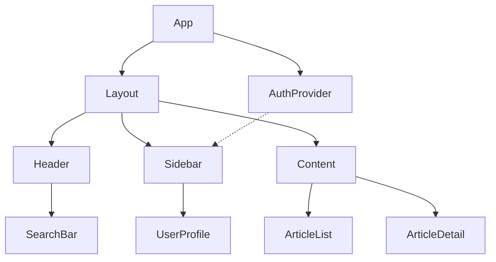
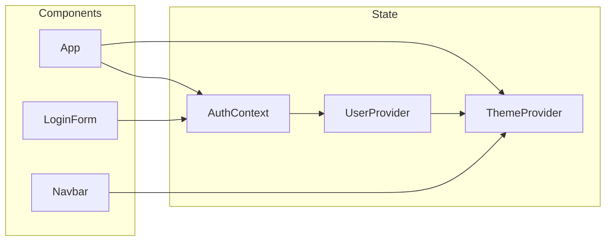
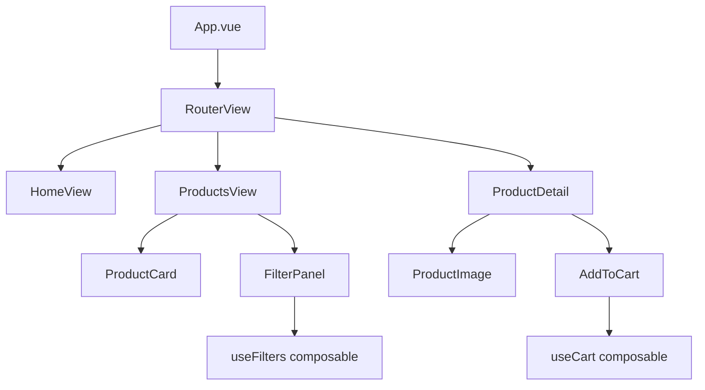
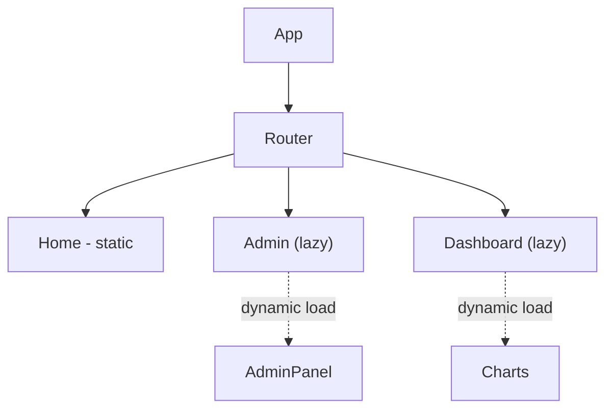
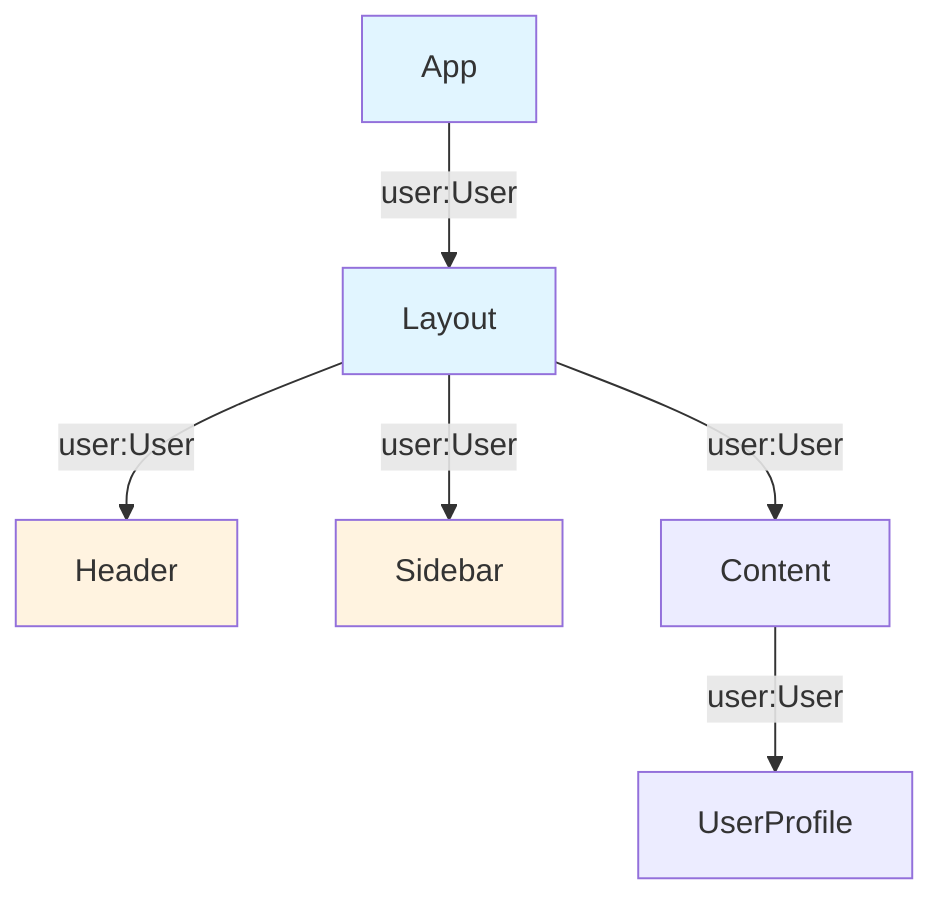



Component diagrams serve as visual documentation that helps teams understand application architecture at a glance. Manually creating these diagrams takes significant time, especially as projects grow and evolve. AI tools now offer practical solutions for generating component diagrams directly from your React or Vue codebase, saving hours of manual documentation work while keeping diagrams synchronized with actual code.

Table of Contents

- [Why AI-Generated Component Diagrams Matter](#why-ai-generated-component-diagrams-matter)
- [Prerequisites](#prerequisites)
- [Practical Examples](#practical-examples)
- [Best Practices](#best-practices)
- [Troubleshooting](#troubleshooting)

Why AI-Generated Component Diagrams Matter

Large React and Vue applications often contain hundreds of components with complex relationships. Understanding parent-child connections, prop drilling patterns, and state management flows becomes increasingly difficult without visual aids. Traditional approaches require developers to manually map out components using tools like draw.io or Lucidchart, a tedious process that quickly becomes outdated as code changes.

AI-powered diagram generation addresses this problem by analyzing your source code and producing accurate representations automatically. This approach provides several advantages: diagrams reflect current code, generation takes seconds rather than hours, and you can regenerate diagrams whenever the architecture changes.

Prerequisites

Before you begin, make sure you have the following ready:

- A computer running macOS, Linux, or Windows
- Terminal or command-line access
- Administrator or sudo privileges (for system-level changes)
- A stable internet connection for downloading tools


Step 1 - Approaches for Generating Component Diagrams with AI

Several strategies exist for using AI to create component diagrams from your frontend projects. Each approach offers different tradeoffs in terms of accuracy, customization, and integration into your workflow.

Using Claude Code or Cursor for Diagram Generation

Modern AI coding assistants can analyze your codebase and generate Mermaid.js or PlantUML code that renders as component diagrams. This method works well because you can edit the generated diagram code directly and integrate it into documentation systems that support these formats.

To generate a diagram using an AI assistant, provide context about your component structure and ask for Mermaid syntax. For a React project, you might use a prompt like:

```
Analyze the components in my src/components directory and generate a Mermaid.js component diagram showing the relationships between App, Layout, Header, Sidebar, Content, and their child components. Include arrows indicating prop passing and state management connections.
```

The AI will examine your code structure and produce Mermaid diagram code. For example, you might receive output like:



You can then render this diagram in Markdown files, documentation sites, or convert it to other formats as needed.

Generating Diagrams from File Structure Analysis

AI tools can also analyze your project file structure and infer component hierarchies based on folder organization, import relationships, and naming conventions. This approach works particularly well for projects using established patterns like atomic design or feature-based folder structures.

Provide your AI assistant with a tree view of your project structure and ask it to generate a diagram. You can create the tree view using:

```bash
find src/components -type f -name "*.tsx" -o -name "*.vue" | head -50
```

Then ask the AI to map these files into a visual component hierarchy. This method works especially well for Vue projects where the file-based routing and component system creates clear organizational patterns.

Using Specialized Diagram Generation Tools

Several tools combine static code analysis with AI to produce more sophisticated diagrams. Tools like Structurizr or generative AI plugins for IDEs can parse your React or Vue code and extract component relationships automatically.

For React projects using Context API or state management libraries, you can ask AI to map data flow:



This type of diagram helps teams understand how state flows through the application, which proves particularly valuable during onboarding or when refactoring state management.

Practical Examples

React Component Diagram Generation

Consider a typical React project structure. When you ask an AI assistant to generate a diagram, provide specific context about your architecture:

```typescript
// Your project's component relationships
// src/
//   App.tsx
//   components/
//     Layout.tsx
//     Header.tsx
//     Sidebar.tsx
//     Dashboard.tsx
//     UserProfile.tsx
//   context/
//     AuthContext.tsx
//     ThemeContext.tsx
//   hooks/
//     useAuth.ts
//     useTheme.ts
```

The AI analyzes import statements to determine relationships and produces an accurate diagram. For complex projects, ask for diagrams that focus on specific areas, such as authentication flow, data fetching patterns, or routing structure.

Vue Component Diagram Generation

Vue's composition API and single-file component structure make it particularly well-suited for AI diagram generation. Vue projects often have clear conventions in component naming and organization that AI tools can recognize and map effectively.

Generate a Vue component diagram by asking the AI to examine your `.vue` files and their composition API setup:



Vue's composables and props system create explicit relationships that AI can accurately map, making the generated diagrams particularly reliable.

Step 2 - Tools and Integrations

Multiple tools can enhance your AI-generated diagram workflow. VS Code extensions like Mermaid Markdown Preview allow you to preview diagrams directly in your editor. For documentation sites, Docusaurus and other static site generators support Mermaid diagrams natively.

If you need more sophisticated visualizations, consider exporting AI-generated diagrams to PlantUML format, which offers additional diagram types and customization options. The key is using AI to do the heavy lifting of mapping relationships, then customizing the output to match your documentation standards.

Best Practices

When using AI to generate component diagrams, provide as much context as possible about your project's architecture patterns and conventions. Specify whether you use atomic design, feature-based organization, or other structural approaches. The more context you give, the more accurate the generated diagram becomes.

For large projects, generate multiple focused diagrams rather than attempting to visualize everything in one view. Separate diagrams for routing, state management, feature modules, and shared components often prove more useful than a single overwhelming diagram.

Regenerate diagrams regularly, especially after significant refactoring. AI makes this process fast enough to include in your workflow whenever architecture changes occur.

Step 3 - Extracting Dependency Data for AI Processing

To generate accurate diagrams, start by gathering your component dependency information. AI can parse this data and convert it to visual format automatically.

```bash
Extract component imports and relationships
find src/components -name "*.tsx" -o -name "*.vue" | xargs grep -h "^import\|^from" | sort | uniq
```

Feed this output to an AI with a prompt like:

> "Analyze these import statements from a React project and create a Mermaid diagram showing the component hierarchy and data flow. Group components by feature area if applicable."

The AI structures this raw data into a coherent visual representation without manual organization.

Step 4 - Comparing Tool Outputs: PlantUML vs Mermaid

Different diagram formats serve different purposes. AI can generate both and help you choose:

Mermaid advantages - Native GitHub/GitLab support, simpler syntax, faster rendering
PlantUML advantages - More sophisticated layouts, advanced styling, broader enterprise tool support

```
Generate both a Mermaid and PlantUML version of this component diagram:
[component structure]

Compare the outputs for:
1. Readability and clarity
2. Styling flexibility
3. Tool environment support in our organization
```

Most teams find Mermaid sufficient for documentation, with PlantUML reserved for complex architectural presentations.

Step 5 - Handling Dynamic Component Generation

Projects with dynamically loaded components or lazy-loaded routes present challenges for static diagram generation. AI can help annotate dynamic patterns:



The dashed lines and annotations clarify which components load dynamically, making the diagram more informative than a simple static hierarchy.

Step 6 - Auto-Updating Diagrams from Code

Some teams integrate AI diagram generation into their CI/CD pipeline. Ask an AI to suggest the approach:

> "Show me a GitHub Actions workflow that automatically regenerates component diagrams whenever `.tsx` or `.vue` files change, commits the updated diagrams to docs/, and opens a PR if changes are detected."

This ensures documentation stays synchronized with actual code without manual effort.

Step 7 - Documenting Prop Drilling and State Flow

Component diagrams benefit from annotations showing data flow. AI can enhance basic diagrams with flow information:



Color coding and prop annotations transform diagrams from visual toys into useful technical documentation.

Step 8 - Integrate Diagrams into Your Documentation Site

Most documentation sites support Mermaid or PlantUML. Ask your AI to help integrate generated diagrams:

> "I use [Docusaurus/Next.js/Jekyll]. Show me how to embed these Mermaid diagrams directly in my markdown documentation with version control integration."

AI provides platform-specific guidance for smooth integration with your existing doc infrastructure.

Troubleshooting

Configuration changes not taking effect

Restart the relevant service or application after making changes. Some settings require a full system reboot. Verify the configuration file path is correct and the syntax is valid.

Permission denied errors

Run the command with `sudo` for system-level operations, or check that your user account has the necessary permissions. On macOS, you may need to grant terminal access in System Settings > Privacy & Security.

Connection or network-related failures

Check your internet connection and firewall settings. If using a VPN, try disconnecting temporarily to isolate the issue. Verify that the target server or service is accessible from your network.


Frequently Asked Questions

How long does it take to use ai to generate component diagrams from react?

For a straightforward setup, expect 30 minutes to 2 hours depending on your familiarity with the tools involved. Complex configurations with custom requirements may take longer. Having your credentials and environment ready before starting saves significant time.

What are the most common mistakes to avoid?

The most frequent issues are skipping prerequisite steps, using outdated package versions, and not reading error messages carefully. Follow the steps in order, verify each one works before moving on, and check the official documentation if something behaves unexpectedly.

Do I need prior experience to follow this guide?

Basic familiarity with the relevant tools and command line is helpful but not strictly required. Each step is explained with context. If you get stuck, the official documentation for each tool covers fundamentals that may fill in knowledge gaps.

Can I adapt this for a different tech stack?

Yes, the underlying concepts transfer to other stacks, though the specific implementation details will differ. Look for equivalent libraries and patterns in your target stack. The architecture and workflow design remain similar even when the syntax changes.

Where can I get help if I run into issues?

Start with the official documentation for each tool mentioned. Stack Overflow and GitHub Issues are good next steps for specific error messages. Community forums and Discord servers for the relevant tools often have active members who can help with setup problems.

Related Articles

- [How to Use AI to Generate Activity Diagrams from User](/how-to-use-ai-to-generate-activity-diagrams-from-user-acceptance-criteria/)
- [How to Generate Mermaid Sequence Diagrams from API Endpoint](/how-to-generate-mermaid-sequence-diagrams-from-api-endpoint-descriptions-using-ai/)
- [AI Coding Assistant Comparison for React Component](/ai-coding-assistant-comparison-for-react-component-generatio/)
- [AI Tools for Creating System Context Diagrams Using C4](/ai-tools-for-creating-system-context-diagrams-using-c4-model/)
- [How to Use AI to Generate Jest Component Tests with Testing](/how-to-use-ai-to-generate-jest-component-tests-with-testing-/)
Built by theluckystrike. More at [zovo.one](https://zovo.one)

