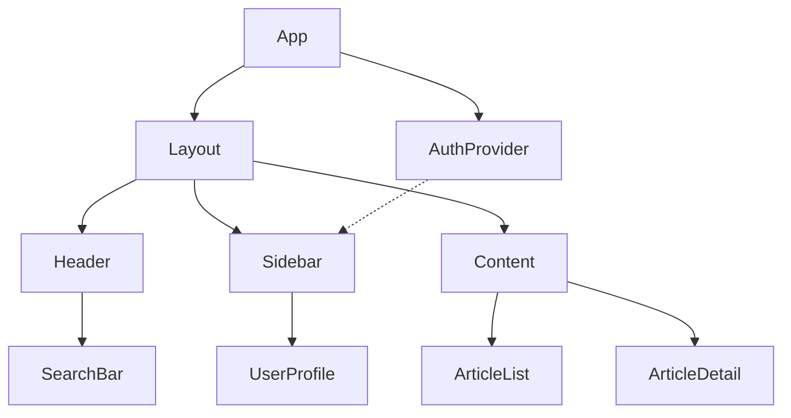
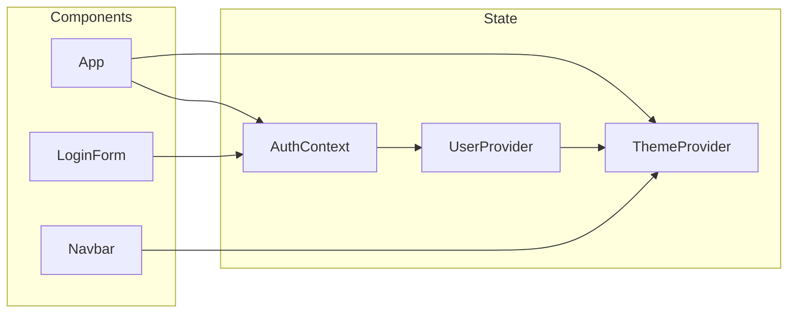
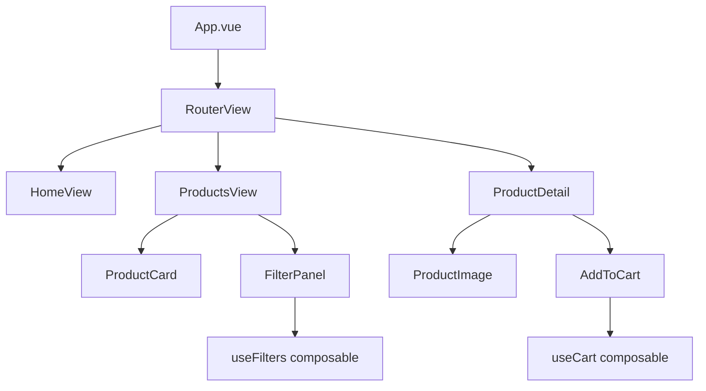




Component diagrams serve as visual documentation that helps teams understand application architecture at a glance. Manually creating these diagrams takes significant time, especially as projects grow and evolve. AI tools now offer practical solutions for generating component diagrams directly from your React or Vue codebase, saving hours of manual documentation work while keeping diagrams synchronized with actual code.


## Why AI-Generated Component Diagrams Matter


Large React and Vue applications often contain hundreds of components with complex relationships. Understanding parent-child connections, prop drilling patterns, and state management flows becomes increasingly difficult without visual aids. Traditional approaches require developers to manually map out components using tools like draw.io or Lucidchart, a tedious process that quickly becomes outdated as code changes.


AI-powered diagram generation addresses this problem by analyzing your source code and producing accurate representations automatically. This approach provides several advantages: diagrams reflect current code, generation takes seconds rather than hours, and you can regenerate diagrams whenever the architecture changes.


## Approaches for Generating Component Diagrams with AI


Several strategies exist for using AI to create component diagrams from your frontend projects. Each approach offers different tradeoffs in terms of accuracy, customization, and integration into your workflow.


### Using Claude Code or Cursor for Diagram Generation


Modern AI coding assistants can analyze your codebase and generate Mermaid.js or PlantUML code that renders as component diagrams. This method works well because you can edit the generated diagram code directly and integrate it into documentation systems that support these formats.


To generate a diagram using an AI assistant, provide context about your component structure and ask for Mermaid syntax. For a React project, you might use a prompt like:


```
Analyze the components in my src/components directory and generate a Mermaid.js component diagram showing the relationships between App, Layout, Header, Sidebar, Content, and their child components. Include arrows indicating prop passing and state management connections.
```


The AI will examine your code structure and produce Mermaid diagram code. For example, you might receive output like:





You can then render this diagram in Markdown files, documentation sites, or convert it to other formats as needed.


### Generating Diagrams from File Structure Analysis


AI tools can also analyze your project file structure and infer component hierarchies based on folder organization, import relationships, and naming conventions. This approach works particularly well for projects using established patterns like atomic design or feature-based folder structures.


Provide your AI assistant with a tree view of your project structure and ask it to generate a diagram. You can create the tree view using:


```bash
find src/components -type f -name "*.tsx" -o -name "*.vue" | head -50
```


Then ask the AI to map these files into a visual component hierarchy. This method works especially well for Vue projects where the file-based routing and component system creates clear organizational patterns.


### Using Specialized Diagram Generation Tools


Several tools combine static code analysis with AI to produce more sophisticated diagrams. Tools like Structurizr or generative AI plugins for IDEs can parse your React or Vue code and extract component relationships automatically.


For React projects using Context API or state management libraries, you can ask AI to map data flow:





This type of diagram helps teams understand how state flows through the application, which proves particularly valuable during onboarding or when refactoring state management.


## Practical Examples


### React Component Diagram Generation


Consider a typical React project structure. When you ask an AI assistant to generate a diagram, provide specific context about your architecture:


```typescript
// Your project's component relationships
// src/
//   App.tsx
//   components/
//     Layout.tsx
//     Header.tsx
//     Sidebar.tsx
//     Dashboard.tsx
//     UserProfile.tsx
//   context/
//     AuthContext.tsx
//     ThemeContext.tsx
//   hooks/
//     useAuth.ts
//     useTheme.ts
```


The AI analyzes import statements to determine relationships and produces an accurate diagram. For complex projects, ask for diagrams that focus on specific areas, such as authentication flow, data fetching patterns, or routing structure.


### Vue Component Diagram Generation


Vue's composition API and single-file component structure make it particularly well-suited for AI diagram generation. Vue projects often have clear conventions in component naming and organization that AI tools can recognize and map effectively.


Generate a Vue component diagram by asking the AI to examine your `.vue` files and their composition API setup:





Vue's composables and props system create explicit relationships that AI can accurately map, making the generated diagrams particularly reliable.


## Tools and Integrations


Multiple tools can enhance your AI-generated diagram workflow. VS Code extensions like Mermaid Markdown Preview allow you to preview diagrams directly in your editor. For documentation sites, Docusaurus and other static site generators support Mermaid diagrams natively.


If you need more sophisticated visualizations, consider exporting AI-generated diagrams to PlantUML format, which offers additional diagram types and customization options. The key is using AI to do the heavy lifting of mapping relationships, then customizing the output to match your documentation standards.


## Best Practices


When using AI to generate component diagrams, provide as much context as possible about your project's architecture patterns and conventions. Specify whether you use atomic design, feature-based organization, or other structural approaches. The more context you give, the more accurate the generated diagram becomes.


For large projects, generate multiple focused diagrams rather than attempting to visualize everything in one view. Separate diagrams for routing, state management, feature modules, and shared components often prove more useful than a single overwhelming diagram.


Regenerate diagrams regularly, especially after significant refactoring. AI makes this process fast enough to include in your workflow whenever architecture changes occur.


## Related Reading

- [Best AI Coding Assistants Compared](/ai-tools-compared/best-ai-coding-assistants-compared/)
- [Best AI Coding Assistant Tools Compared 2026](/ai-tools-compared/best-ai-coding-assistant-tools-compared-2026/)
- [AI Tools Guides Hub](/ai-tools-compared/guides-hub/)

Built by the luckystrike — More at [zovo.one](https://zovo.one)


